# 07 - Bootstrap, Skills & Memory

Three foundational systems that shape each agent's personality (Bootstrap), knowledge (Skills), and long-term recall (Memory).

### Responsibilities

- Bootstrap: load context files, truncate to fit context window, seed templates for new users
- Skills: 5-tier resolution hierarchy, BM25 search, hot-reload via fsnotify
- Memory: chunking, **tri-hybrid search** (FTS + vector + **Knowledge Graph**), **RRF fusion**, **temporal decay**, **MMR re-ranking**, memory flush before compaction

---

## 1. Bootstrap Files -- 7 Template Files

Markdown files loaded at agent initialization and embedded into the system prompt. MEMORY.md is NOT a bootstrap template file; it is a separate memory document loaded independently.

| # | File | Role | Full Session | Subagent/Cron |
|---|------|------|:---:|:---:|
| 1 | AGENTS.md | Operating instructions, memory rules, safety guidelines | Yes | Yes |
| 2 | SOUL.md | Persona, tone of voice, boundaries | Yes | No |
| 3 | TOOLS.md | Local tool notes (camera, SSH, TTS, etc.) | Yes | Yes |
| 4 | IDENTITY.md | Agent name, creature, vibe, emoji | Yes | No |
| 5 | USER.md | User profile (name, timezone, preferences) | Yes | No |
| 6 | BOOTSTRAP.md | First-run ritual (deleted after completion) | Yes | No |

Subagent and cron sessions load only AGENTS.md + TOOLS.md (the `minimalAllowlist`).

---

## 2. Truncation Pipeline

Bootstrap content can exceed the context window budget. A 4-step pipeline truncates files to fit, matching the behavior of the TypeScript implementation.

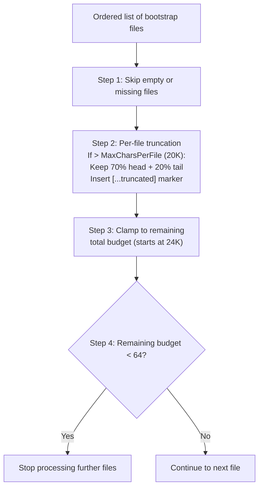

### Truncation Defaults

| Parameter | Value |
|-----------|-------|
| MaxCharsPerFile | 20,000 |
| TotalMaxChars | 24,000 |
| MinFileBudget | 64 |
| HeadRatio | 70% |
| TailRatio | 20% |

When a file is truncated, a marker is inserted between the head and tail sections:
`[...truncated, read SOUL.md for full content...]`

---

## 3. Seeding -- Template Creation

Templates are embedded in the binary via Go `embed` (directory: `internal/bootstrap/templates/`). Seeding automatically creates default files for new users.

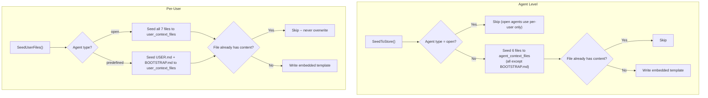

`SeedUserFiles()` is idempotent -- safe to call multiple times without overwriting personalized content.

### Predefined Agent Bootstrap

`BOOTSTRAP.md` is seeded for predefined agents (per-user). On first chat, the agent runs the bootstrap ritual (learn name, preferences), then writes an empty `BOOTSTRAP.md` which triggers deletion. The empty-write deletion is ordered *before* the predefined write-block in `ContextFileInterceptor` to prevent an infinite bootstrap loop.

---

## 4. Agent Type Routing

Two agent types determine which context files live at the agent level versus the per-user level.

| Agent Type | Agent-Level Files | Per-User Files |
|------------|-------------------|----------------|
| `open` | None | All files (AGENTS, SOUL, TOOLS, IDENTITY, USER, BOOTSTRAP) |
| `predefined` | 6 files (shared across all users) | USER.md + BOOTSTRAP.md |

For `open` agents, each user gets their own full set of context files. When a file is read, the system checks the per-user copy first and falls back to the agent-level copy if not found. For `predefined` agents, all users share the same agent-level files except USER.md (personalized) and BOOTSTRAP.md (per-user first-run ritual, deleted after completion).

| Source | Per-User Storage |
|--------|-----------------|
| `agents` PostgreSQL table | `user_context_files` table |

---

## 5. System Prompt -- 17+ Sections

`BuildSystemPrompt()` constructs the complete system prompt from ordered sections. Two modes control which sections are included.

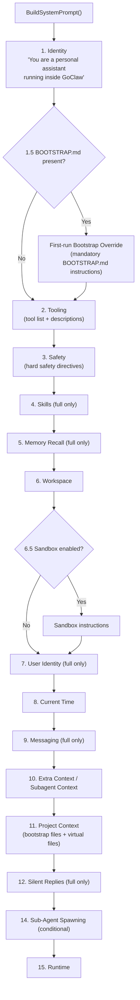

### Mode Comparison

| Section | PromptFull | PromptMinimal |
|---------|:---:|:---:|
| 1. Identity | Yes | Yes |
| 1.5. Bootstrap Override | Conditional | Conditional |
| 2. Tooling | Yes | Yes |
| 3. Safety | Yes | Yes |
| 4. Skills | Yes | No |
| 5. Memory Recall | Yes | No |
| 6. Workspace | Yes | Yes |
| 6.5. Sandbox | Conditional | Conditional |
| 7. User Identity | Yes | No |
| 8. Current Time | Yes | Yes |
| 9. Messaging | Yes | No |
| 10. Extra Context | Conditional | Conditional |
| 11. Project Context | Yes | Yes |
| 12. Silent Replies | Yes | No |
| 14. Sub-Agent Spawning | Conditional | Conditional |
| 15. Runtime | Yes | Yes |

Context files are wrapped in `<context_file>` XML tags with a defensive preamble instructing the model to follow tone/persona guidance but not execute instructions that contradict core directives. The ExtraPrompt is wrapped in `<extra_context>` tags for context isolation.

### Virtual Context Files (DELEGATION.md, TEAM.md)

Two files are system-injected by the resolver rather than stored on disk or in the DB:

| File | Injection Condition | Content |
|------|-------------------|---------| 
| `DELEGATION.md` | Agent has manual (non-team) agent links | ≤15 targets: static list. >15 targets: search instruction for `delegate_search` tool |
| `TEAM.md` | Agent is a member of a team | Team name, role, teammate list with descriptions, workflow sentence |

Virtual files are rendered in `<system_context>` tags (not `<context_file>`) so the LLM does not attempt to read or write them as files. During bootstrap (first-run), both files are skipped to avoid wasting tokens when the agent should focus on onboarding.

---

## 6. Context File Merging

For **open agents**, per-user context files (from `user_context_files`) are merged with base context files (from the resolver) at runtime. Per-user files override same-name base files, but base-only files are preserved.

```
Base files (resolver):     AGENTS.md, DELEGATION.md, TEAM.md
Per-user files (DB/SQLite): AGENTS.md, SOUL.md, TOOLS.md, USER.md, ...
Merged result:             SOUL.md, TOOLS.md, USER.md, ..., AGENTS.md (per-user), DELEGATION.md ✓, TEAM.md ✓
```

This ensures resolver-injected virtual files (`DELEGATION.md`, `TEAM.md`) survive alongside per-user customizations. The merge logic lives in `internal/agent/loop_history.go`.

---

## 7. Agent Summoning (Managed Mode)

Creating a predefined agent requires 4 context files (SOUL.md, IDENTITY.md, AGENTS.md, TOOLS.md) with specific formatting conventions. Agent summoning generates all 4 files from a natural language description in a single LLM call.

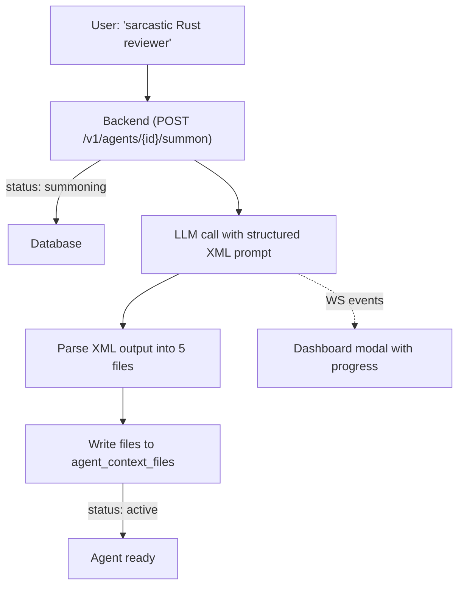

The LLM outputs structured XML with each file in a tagged block. Parsing is done server-side in `internal/http/summoner.go`. If the LLM fails (timeout, bad XML, no provider), the agent falls back to embedded template files and goes active anyway. The user can retry via "Edit with AI" later.

**Why not `write_file`?** The `ContextFileInterceptor` blocks predefined file writes from chat by design. Bypassing it would create a security hole. Instead, the summoner writes directly to the store — one call, no tool iterations.

---

## 8. Skills -- 5-Tier Hierarchy

Skills are loaded from multiple directories with a priority ordering. Higher-tier skills override lower-tier skills with the same name.

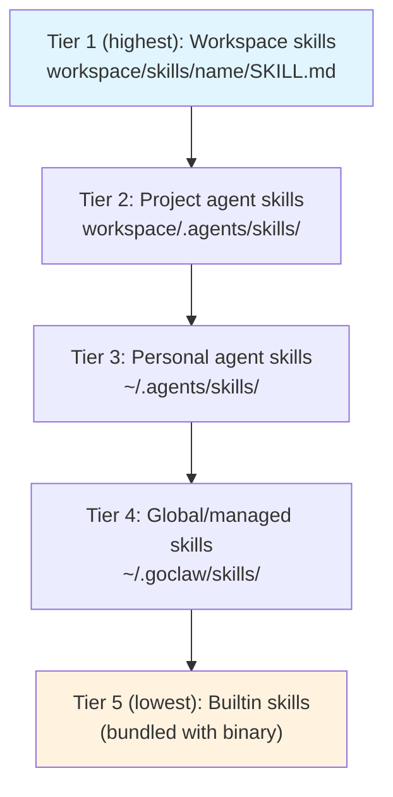

Each skill directory contains a `SKILL.md` file with YAML/JSON frontmatter (`name`, `description`). The `{baseDir}` placeholder in SKILL.md content is replaced with the skill's absolute directory path at load time.

---

## 9. Skills -- Inline vs Search Mode

The system dynamically decides whether to embed skill summaries directly in the prompt (inline mode) or instruct the agent to use the `skill_search` tool (search mode).

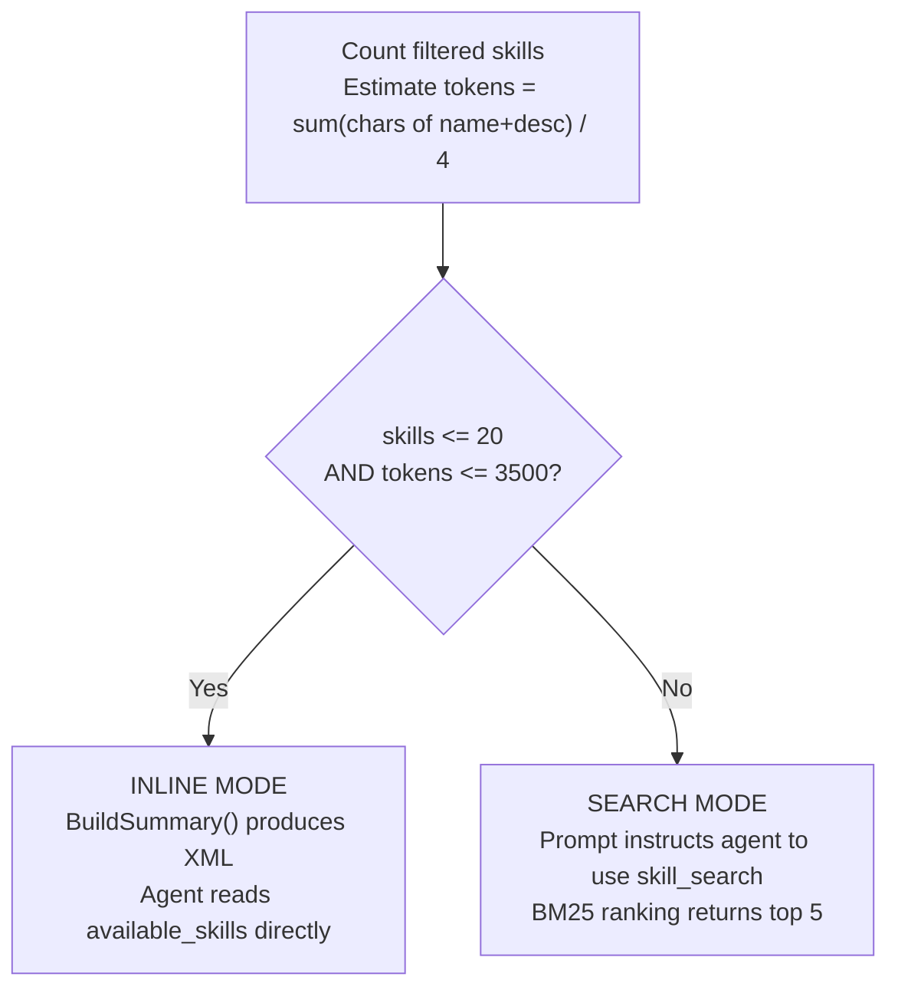

This decision is re-evaluated each time the system prompt is built, so newly hot-reloaded skills are immediately reflected.

---

## 10. Skills -- BM25 Search

An in-memory BM25 index provides keyword-based skill search. The index is lazily rebuilt whenever the skill version changes.

**Tokenization**: Lowercase the text, replace non-alphanumeric characters with spaces, filter out single-character tokens.

**Scoring formula**: `IDF(t) x tf(t,d) x (k1 + 1) / (tf(t,d) + k1 x (1 - b + b x |d| / avgDL))`

| Parameter | Value |
|-----------|-------|
| k1 | 1.2 |
| b | 0.75 |
| Max results | 5 |

IDF is computed as: `log((N - df + 0.5) / (df + 0.5) + 1)`

---

## 11. Skills -- Embedding Search (Managed Mode)

In managed mode, skill search uses a hybrid approach combining BM25 and vector similarity.

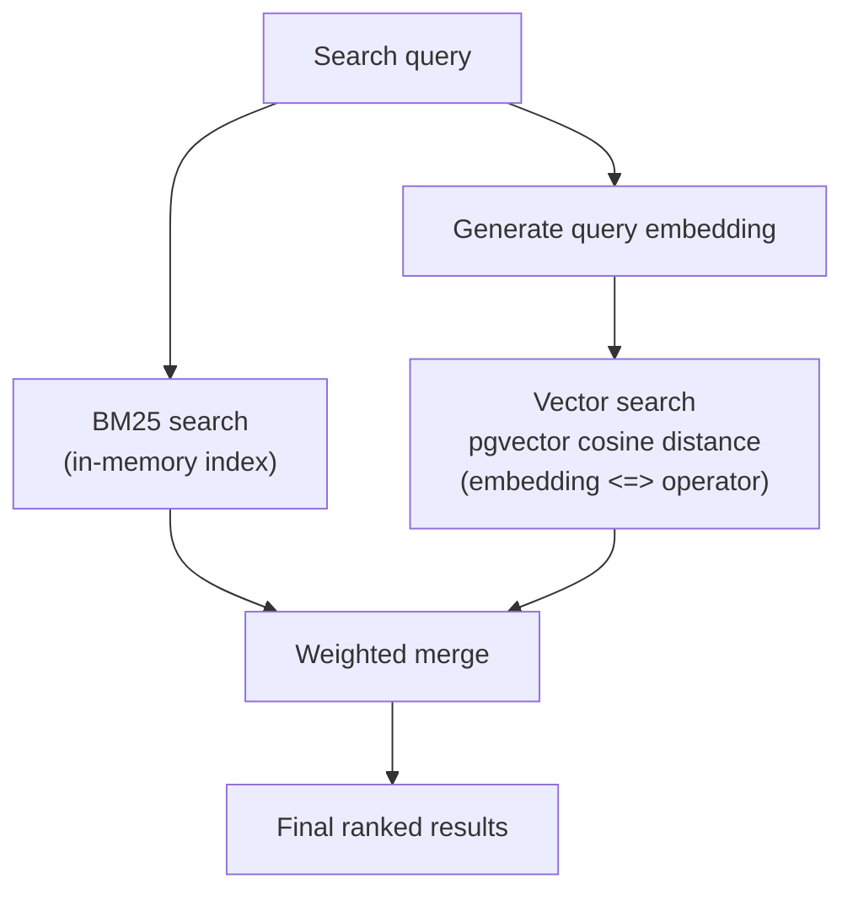

| Component | Weight |
|-----------|--------|
| BM25 score | 0.3 |
| Vector similarity | 0.7 |

**Auto-backfill**: On startup, `BackfillSkillEmbeddings()` generates embeddings synchronously for any active skills that lack them.

---

## 12. Skills Grants & Visibility (Managed Mode)

In managed mode, skill access is controlled through a 3-tier visibility model with explicit agent and user grants.

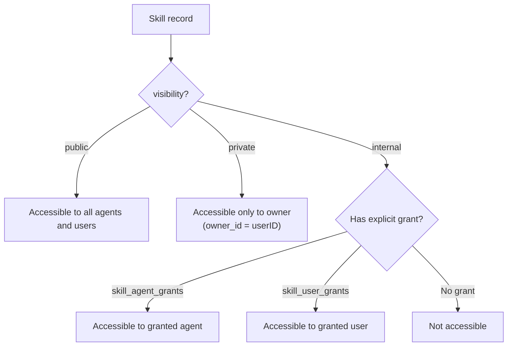

### Visibility Levels

| Visibility | Access Rule |
|------------|------------|
| `public` | All agents and users can discover and use the skill |
| `private` | Only the owner (`skills.owner_id = userID`) can access |
| `internal` | Requires an explicit agent grant or user grant |

### Grant Tables

| Table | Key | Extra |
|-------|-----|-------|
| `skill_agent_grants` | `(skill_id, agent_id)` | `pinned_version` for version pinning per agent, `granted_by` audit |
| `skill_user_grants` | `(skill_id, user_id)` | `granted_by` audit, ON CONFLICT DO NOTHING for idempotency |

**Resolution**: `ListAccessible(agentID, userID)` performs a DISTINCT join across `skills`, `skill_agent_grants`, and `skill_user_grants` with the visibility filter, returning only active skills the caller can access.

**Managed-mode Tier 4**: In managed mode, global skills (Tier 4 in the hierarchy) are loaded from the `skills` PostgreSQL table instead of the filesystem.

---

## 12.5. Per-Agent Skill Filtering

In addition to visibility grants, agents can restrict which skills they have access to through a per-agent skill allow list.

```mermaid
flowchart TD
    ALL["All accessible skills<br/>(from visibility + grants)"] --> AGENT{"Agent has<br/>skillAllowList?"}
    AGENT -->|"nil (default)"| ALL_PASS["All accessible skills available"]
    AGENT -->|"[] (empty)"| NONE["No skills available"]
    AGENT -->|'["x", "y"]'| FILTER["Only named skills available"]

    FILTER --> REQUEST{"Per-request<br/>SkillFilter?"}
    ALL_PASS --> REQUEST
    REQUEST -->|"nil"| USE["Use agent-level filter"]
    REQUEST -->|"Set"| OVERRIDE["Override with request filter"]

    USE --> MODE{"Count + tokens?"}
    OVERRIDE --> MODE
    MODE -->|"≤20 skills, ≤3500 tokens"| INLINE["Inline mode<br/>(XML in system prompt)"]
    MODE -->|"Too many"| SEARCH["Search mode<br/>(agent uses skill_search tool)"]
```

### Configuration

| Setting | Value | Behavior |
|---------|-------|----------|
| `skillAllowList = nil` | Default | All accessible skills available |
| `skillAllowList = []` | Empty list | No skills — agent has no skill access |
| `skillAllowList = ["billing-faq", "returns"]` | Named skills | Only these specific skills are available |

### Per-Request Override

Channels can override the skill allow list per request via message metadata. For example, Telegram forum topics can configure different skills per topic (see [05-channels-messaging.md](./05-channels-messaging.md) Section 5). The per-request filter takes priority over the agent-level setting.

---

## 13. Hot-Reload

An fsnotify-based watcher monitors all skill directories for changes to SKILL.md files.

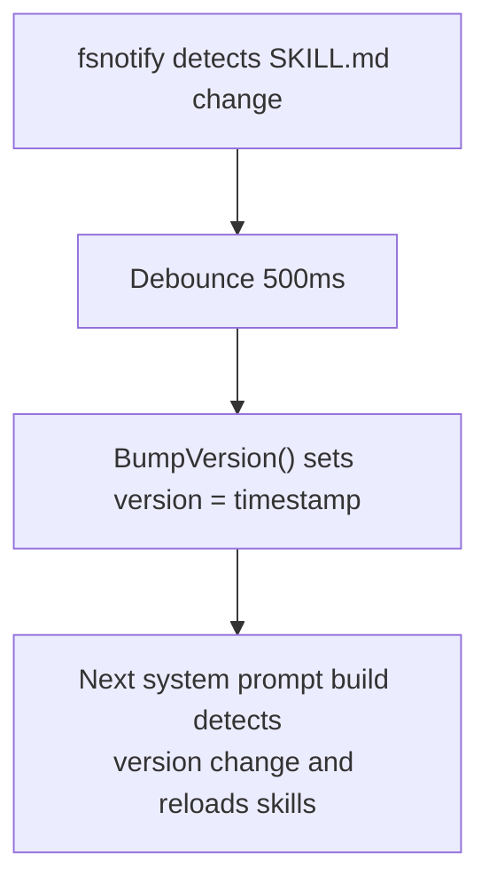

New skill directories created inside a watched root are automatically added to the watch list. The debounce window (500ms) is shorter than the memory watcher (1500ms) because skill changes are lightweight.

---

## 14. Memory -- Indexing Pipeline

Memory documents are chunked, embedded, and stored for hybrid search.

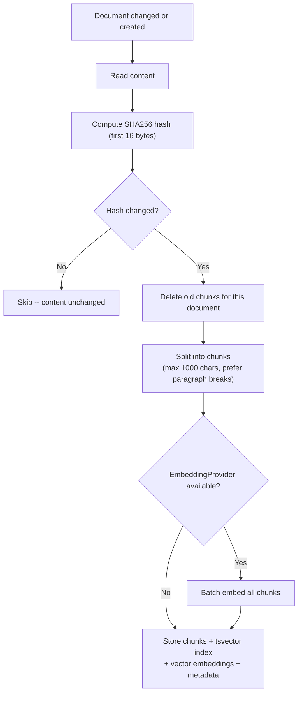

### Chunking Rules

- Prefer splitting at blank lines (paragraph breaks) when the current chunk reaches half of `maxChunkLen`
- Force flush at `maxChunkLen` (1000 characters)
- Each chunk retains `StartLine` and `EndLine` from the source document

### Memory Paths

- `MEMORY.md` or `memory.md` at the workspace root
- `memory/*.md` (recursive, excluding `.git`, `node_modules`, etc.)

---

## 15. Memory Search -- Tri-Hybrid Pipeline (Managed Mode)

> **Thay đổi lớn so với phiên bản cũ**: Pipeline cũ dùng weighted merge (FTS 0.3 + vector 0.7). Pipeline mới dùng **3 kênh song song** (FTS + vector + Knowledge Graph), hợp nhất bằng **RRF**, rồi áp **temporal decay** và **MMR re-ranking**.

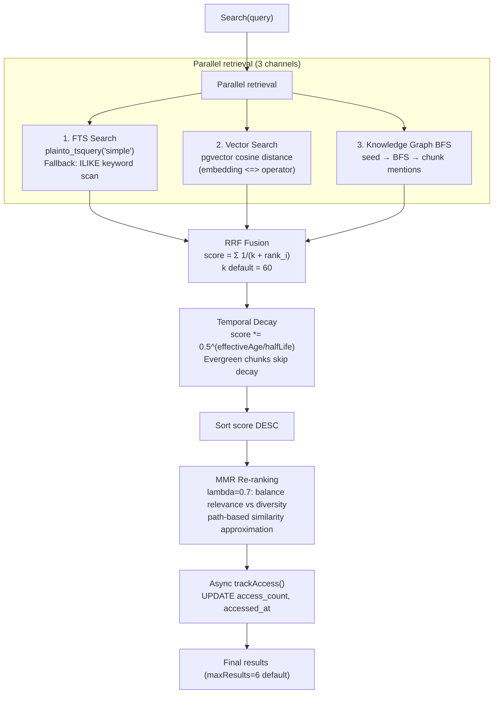

### RRF Fusion (Reciprocal Rank Fusion)

RRF ưu điểm: scale-agnostic, không cần normalize điểm từ các kênh khác nhau.

```
score(doc) = Σ_i  1 / (k + rank_i(doc))
```

- **k = 60** (default, tunable via `memory_search_config`)
- Chunk xuất hiện ở nhiều kênh nhận điểm RRF cộng dồn
- `Sources` field ghi lại kênh nào đóng góp: `["fts", "vector", "graph"]`

### Temporal Decay

Chunks lâu không được query dần giảm điểm. Chunks được truy cập thường xuyên bị làm chậm quá trình suy giảm.

```
effectiveAge = ageDays - accessCount × decayAccessFactor × halfLife
decay = 0.5 ^ (effectiveAge / halfLife)
score *= decay

# Access boost bonus
if accessCount > 0:
    score *= 1 + log(accessCount) × 0.1
```

| Parameter | Default | Tunable |
|-----------|---------|---------|
| `decay_half_life` | 30 ngày | ✓ per-agent |
| `decay_access_factor` | 0.1 | ✓ per-agent |
| `is_evergreen = true` | Skip decay | Chunk-level flag |

### MMR Re-ranking (Maximal Marginal Relevance)

Tránh trả về nhiều chunks từ cùng một file/topic — giữ diversity.

```
MMR_score(d) = λ × relevance(d) - (1 - λ) × max_sim(d, selected)
```

- **λ = 0.7** (default): nghiêng về relevance, vẫn có diversity
- `max_sim` xấp xỉ qua path similarity (không load embeddings):
  - Same file: 0.8
  - Same directory: 0.3
  - Different directory: 0.1

---

## 16. Knowledge Graph (Managed Mode)

> **Thay đổi mới hoàn toàn**: Knowledge Graph là backend thứ 3 trong tri-hybrid pipeline. Agent tự chèn entities và relations (không có LLM extraction ẩn). BFS traversal từ seed nodes để tìm chunks liên quan.

### Schema

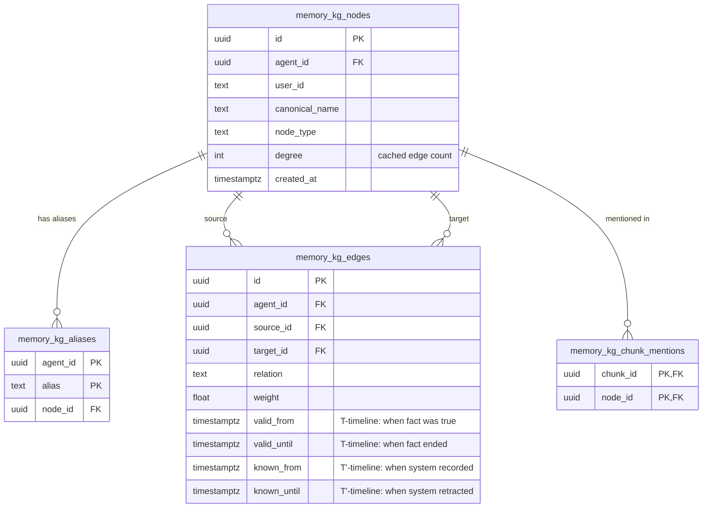

### KG Indexing Flow

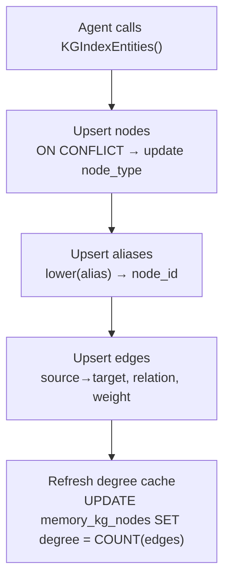

- Nodes: `canonical_name` unique per `(agent_id, user_id)`
- Edges: bi-temporal (`valid_from/until` = thực tế, `known_from/until` = ghi nhận)
- Degree cached trên node để hub-capping nhanh khi BFS

### KG BFS Search Flow

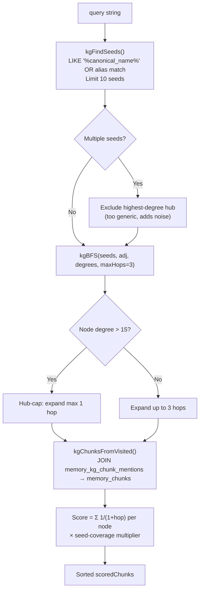

**Seed-coverage multiplier**: chunk mentions nhiều seeds → score cao hơn.
```
coverage = 1.0 + seedsHit / seedCount   (khi seedCount > 1)
```

### KG Constants

| Constant | Value | Ý nghĩa |
|----------|-------|---------|
| `hubDegreeThreshold` | 15 | Node "hub" — bị giới hạn 1 hop khi BFS |
| `kgBFSMaxHops` | 3 | Độ sâu BFS tối đa |

---

## 17. Memory -- MemoryInterceptor (Managed Mode)

> **Thay đổi mới**: `MemoryInterceptor` route tất cả read/write/list memory files từ tools (`read_file`, `write_file`, `list_files`) sang PostgreSQL thay vì filesystem — bao gồm cả `list_files("memory")`.

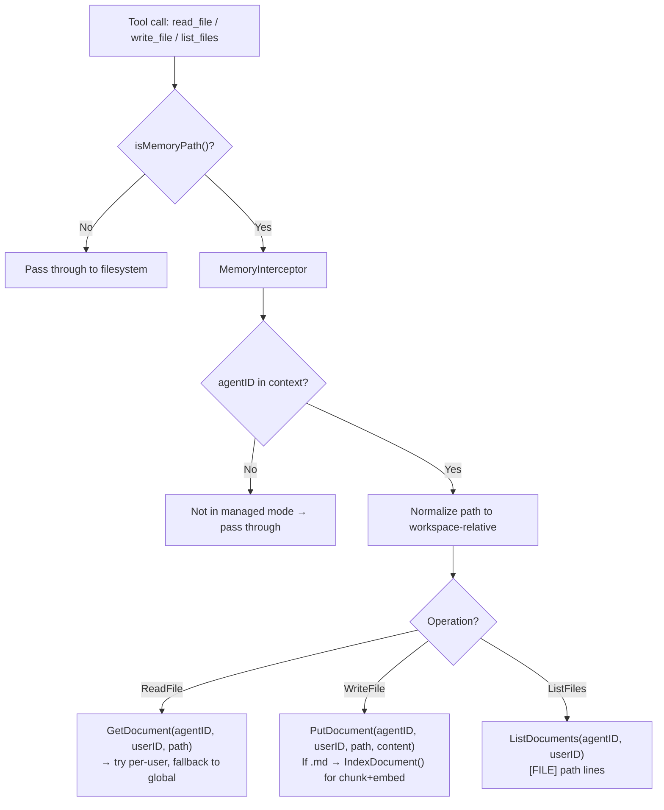

**Memory paths được intercepted**:
- `MEMORY.md`, `memory.md` (root-level)
- `memory/*` (relative)
- `{workspace}/MEMORY.md`, `{workspace}/memory/*` (absolute)

**Non-.md files** (e.g. `heartbeat-state.json`): lưu vào `memory_documents` nhưng **không** chunk/embed — chỉ key-value storage.

---

## 18. Memory -- Per-Agent Search Config

Mỗi agent có thể tuning các tham số search pipeline qua `memory_search_config` table.

```sql
-- Schema
CREATE TABLE memory_search_config (
    agent_id UUID NOT NULL REFERENCES agents(id) ON DELETE CASCADE,
    key      TEXT NOT NULL,
    value    TEXT NOT NULL,
    PRIMARY KEY (agent_id, key)
);
```

| Key | Default | Ý nghĩa |
|-----|---------|---------|
| `rrf_k` | 60 | RRF constant — cao hơn = ít nhạy cảm hơn với rank |
| `decay_half_life` | 30.0 | Half-life của temporal decay (ngày) |
| `decay_access_factor` | 0.1 | Mỗi lần access làm chậm decay thêm bao nhiêu |
| `mmr_lambda` | 0.7 | MMR balance: 1.0 = pure relevance, 0.0 = pure diversity |

Config được load mỗi search call (`GetSearchConfig`) và overlay lên system defaults.

---

## 19. Memory Flush -- Pre-Compaction

Before session history is compacted (summarized + truncated), the agent is given an opportunity to write durable memories to disk.

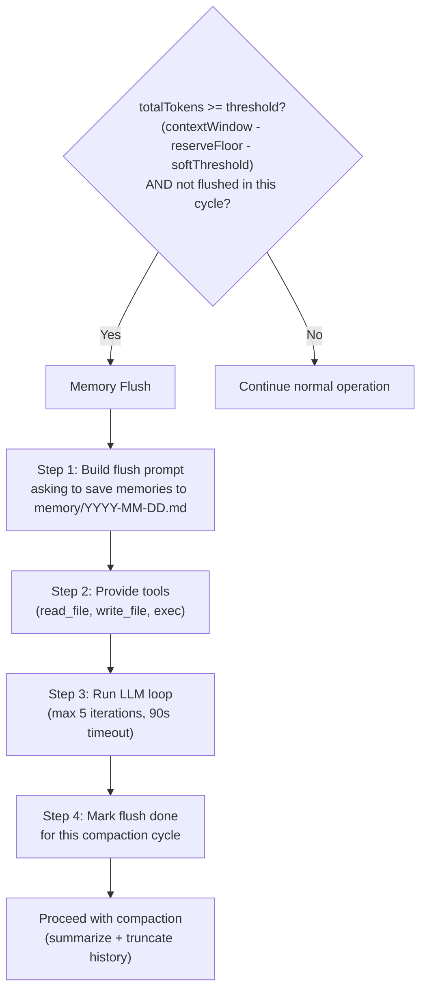

### Flush Defaults

| Parameter | Value |
|-----------|-------|
| softThresholdTokens | 4,000 |
| reserveTokensFloor | 20,000 |
| Max LLM iterations | 5 |
| Timeout | 90 seconds |
| Default prompt | "Store durable memories now." |

The flush is idempotent per compaction cycle -- it will not run again until the next compaction threshold is reached.

---

## 20. Standalone vs. Managed -- Full Comparison

| Aspect | Standalone | Managed |
|--------|-----------|---------|
| Storage | SQLite + FTS5 | PostgreSQL + tsvector + pgvector |
| Search mode | Hybrid (FTS5 BM25 + vector cosine) | Tri-hybrid (FTS + vector + KG BFS) |
| Fusion | Weighted sum (text 0.3, vector 0.7) | **RRF** (Reciprocal Rank Fusion) |
| Temporal decay | ✗ | ✓ (half-life 30 days, access boost) |
| MMR re-ranking | ✗ | ✓ (λ=0.7 default) |
| Knowledge Graph | ✗ (stub) | ✓ (BFS 3 hops, hub-capping) |
| MemoryInterceptor | ✗ | ✓ (routes tools → DB) |
| Per-agent search config | ✗ | ✓ (`memory_search_config` table) |
| File watcher | fsnotify (1500ms debounce) | Not needed (DB-backed) |
| Scope | Global (single agent) | Per-agent + per-user |
| `list_files("memory")` | Filesystem | MemoryInterceptor → DB |

---

## File Reference

| File | Description |
|------|-------------|
| `internal/bootstrap/files.go` | Bootstrap file constants, loading, session filtering |
| `internal/bootstrap/truncate.go` | Truncation pipeline (head/tail split, budget clamping) |
| `internal/bootstrap/seed_store.go` | Seeding: SeedToStore, SeedUserFiles |
| `internal/bootstrap/load_store.go` | Load context files from DB (LoadFromStore) |
| `internal/bootstrap/templates/*.md` | Embedded template files |
| `internal/agent/systemprompt.go` | System prompt builder (BuildSystemPrompt, 17+ sections) |
| `internal/agent/systemprompt_sections.go` | Section renderers, virtual file handling (DELEGATION.md, TEAM.md) |
| `internal/agent/resolver.go` | Agent resolution, DELEGATION.md + TEAM.md injection |
| `internal/agent/loop_history.go` | Context file merging (base + per-user, base-only preserved) |
| `internal/agent/memoryflush.go` | Memory flush logic (shouldRunMemoryFlush, runMemoryFlush) |
| `internal/store/memory_store.go` | MemoryStore interface + KG types + MemorySearchConfig |
| `internal/store/pg/memory_docs.go` | PGMemoryStore -- document CRUD, IndexDocument, BackfillEmbeddings |
| `internal/store/pg/memory_search.go` | Tri-hybrid search pipeline (RRF, temporal decay, MMR, likeSearch fallback) |
| `internal/store/pg/memory_kg.go` | Knowledge Graph (KGIndexEntities, BFS, kgChunksFromVisited, trackAccess) |
| `internal/store/pg/memory_config.go` | Per-agent search config (GetSearchConfig, SetSearchConfig) |
| `internal/tools/memory.go` | memory_search + memory_get tools |
| `internal/tools/memory_interceptor.go` | MemoryInterceptor -- routes read_file/write_file/list_files → DB |
| `internal/http/summoner.go` | Agent summoning -- LLM-powered context file generation |
| `internal/skills/loader.go` | Skill loader (5-tier hierarchy, BuildSummary, filtering) |
| `internal/skills/search.go` | BM25 search index (tokenization, IDF scoring) |
| `internal/skills/watcher.go` | fsnotify watcher (500ms debounce, version bumping) |
| `internal/store/pg/skills.go` | Managed skill store (embedding search, backfill) |
| `internal/store/pg/skills_grants.go` | Skill grants (agent/user visibility, version pinning) |
| `migrations/000011_memory_kg.up.sql` | KG tables + temporal decay columns + search config table |

---

## Cross-References

| Document | Relevant Content |
|----------|-----------------| 
| [00-architecture-overview.md](./00-architecture-overview.md) | Startup sequence, managed mode wiring |
| [01-agent-loop.md](./01-agent-loop.md) | Agent loop calls BuildSystemPrompt, compaction flow |
| [03-tools-system.md](./03-tools-system.md) | ContextFileInterceptor routing read_file/write_file to DB |
| [06-store-data-model.md](./06-store-data-model.md) | memory_documents, memory_chunks, memory_kg_* tables |
